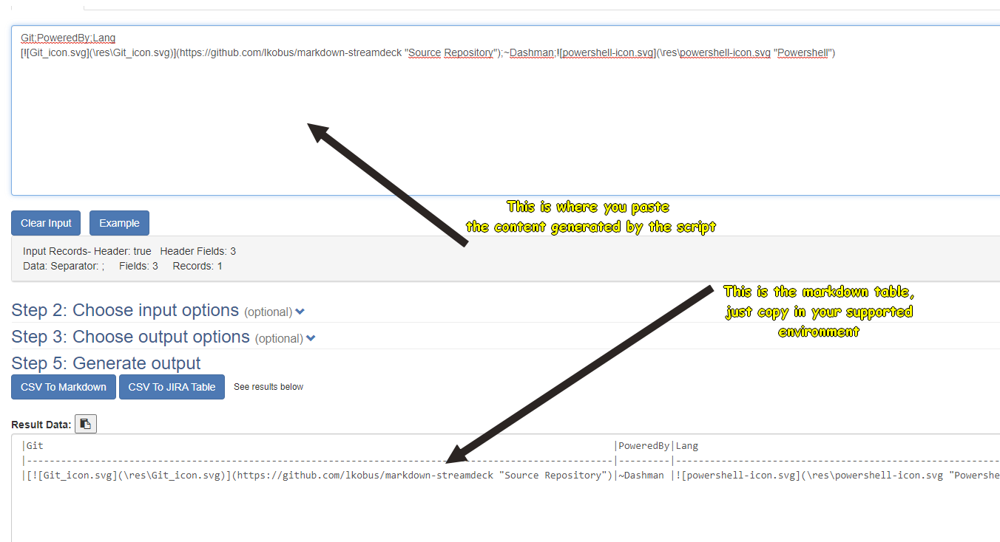
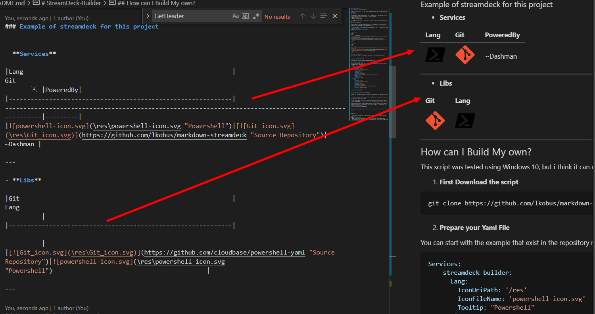

# StreamDeck-Builder

Hello, welcome to the StreamDeckBuilder.

The **StreamDeckBuilder** is a tool written in powershell that convert a YAML structure to a CSV file. With this you can have a "streamdeck feeling" using a combination of links and icons.

## StreamDeck  

Streamdecks are hardware that are mainly used by streamers, its a panel that has a lot of buttons, where each button is a trigger for something example:
* Any famous Meme sound
* Piece of music
* Changing overlay screens

In reusme just a collection of actions that are visible by big buttons and acessible at the same time. 

## Acessible and Visible 

Well if you are a developer you know that you have to remember a lot of links, and there a newcomers to your teams, and if you are growing up in microservices archtecture maybe you have a lot more actions than a usual application has.

This is where we can try use ideas inspired by Streamdeck to just be a place where we can be "visible & acessible"

### Example of streamdeck for this project


- **Services**

|Lang                                                         |Git                                                                                                    |PoweredBy|
|-------------------------------------------------------------|-------------------------------------------------------------------------------------------------------|---------|
||[](https://github.com/lkobus/markdown-streamdeck "Source Repository")|~Dashman |

---

- **Libs**

|Git                                                          |Lang                                                                                                   |
|-------------------------------------------------------------|-------------------------------------------------------------------------------------------------------|
|[](https://github.com/cloudbase/powershell-yaml "Source Repository")|                                          |

---

## How can I Build My own?

This script was tested using Windows 10, but i think it can rune fine in Ubuntu too.


1. **First Download the script**

```ps
git clone https://github.com/lkobus/markdown-streamdeck.git .
```
2. **Prepare your Yaml File**

You can start with the example that exist in the repository named "micro_services.yaml" in the repository to get started
```yaml
Services:
  - streamdeck-builder:
      Lang:        
        IconUriPath: '/res'
        IconFileName: 'powershell-icon.svg'
        Tooltip: "Powershell"      
      Git:
        ColumnPosition: 1
        IconUriPath: "/res"
        IconFileName: 'Git_icon.svg'
        Tooltip: "Source Repository"
        Hyperlink: "https://github.com/lkobus/markdown-streamdeck"
      PoweredBy:       
        ColumnPosition: 2
        Description: "~Dashman"  
Libs:
  - powershell-yaml:
      Lang:
        IconUriPath: '/res'
        IconFileName: 'powershell-icon.svg'
        Tooltip: "Powershell"       
      Git:      
        IconUriPath: "/res"
        IconFileName: 'Git_icon.svg'
        Tooltip: "Source Repository"
        Hyperlink: "https://github.com/cloudbase/powershell-yaml"
      Name:
        Description: "powershell-yaml"
      
```
~*micro_services.yaml File*


3. **For generating the output you should run**

```ps1
$script_dir> .\StreamDeck-Builder.ps1 -yamlInput .\micro_services.yaml -outputCsv .\out.csv
```

> This will create two tables "out.csv" for the "Services" and "out-libs.csv" for the Libs.

4. **Generating the markdown table**

The CSV now is wrapped correctly with the links you builded in markdown, now you can just use tools that convert "CSV to Markdown table" and you should have the template to past it in your Markdown Page.

Usualy i just get the CSV content, copy and paste in this site called [convertcsv](https://www.convertcsv.com/csv-to-markdown.htm), get the result and paste it in my markdown site.

See the illustration bellow:



5. **Example from this page : **


---

---


### Contact?

- Fell free to contribute, and if you wanna get in touch reach me in linkedin ("leonardo kobus BR")

### Final considerations
- Maybe for you run the powershell you should give a permission to "unsigned script". 
- I recommend you just read the powershell script always to see if you are not using a wrong version, that someone can modify.
- I recommend use icons in .svg and that you make a "standard" resolution
  - In this page all the icons are configured to: 
  ```html  
  <svg width="42px" height="42"...
  ```